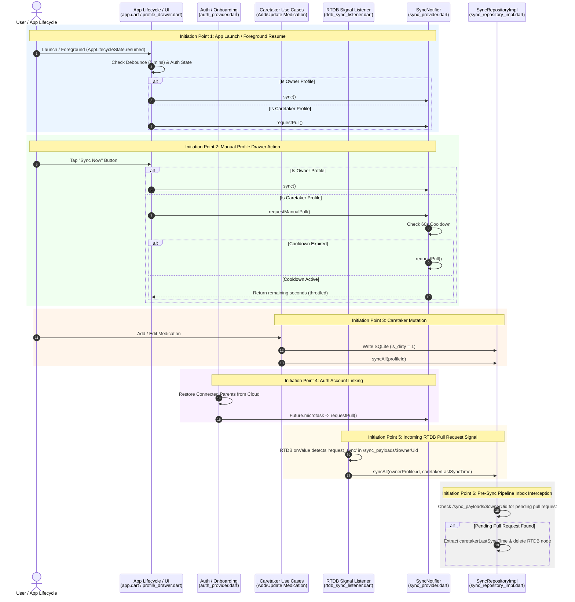
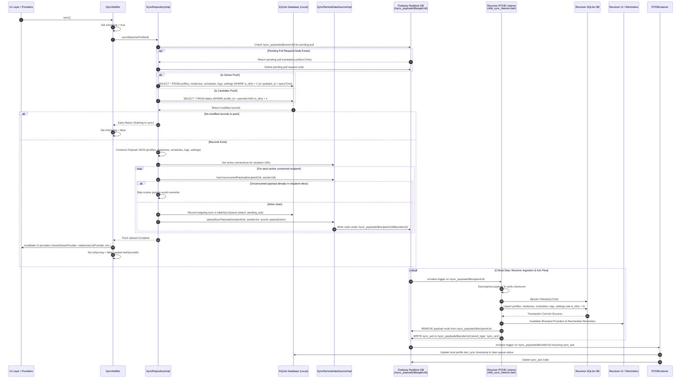
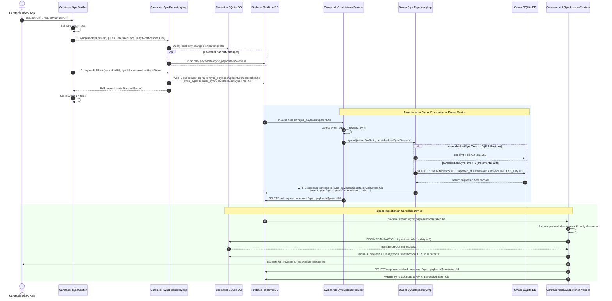

# Sync Flow Initiation & Sequence Diagrams

This document details all initiation points for synchronization in the app and provides Mermaid sequence diagrams mapping out the complete flow, critical decision steps, and data exchange logic.

---

## 1. Summary of Sync Initiation Points

Sync in this application is initiated from **6 key entry points**:

| # | Initiation Point | Trigger / Condition | Code Location | Action Performed |
|---|---|---|---|---|
| **1** | **App Startup & Foreground Resume** | App launch (`addPostFrameCallback`) or app returning to foreground (`AppLifecycleState.resumed`). Requires authenticated user, not currently syncing, and last sync $\ge 5$ mins ago (or null). | [app.dart](file:///Users/rajshekhar/code/projects/MedicineTrackerAppV2/lib/app.dart#L112-L165) | Owner $\rightarrow$ `SyncNotifier.sync()` (Push) Caretaker $\rightarrow$ `SyncNotifier.requestPull()` (Pull) |
| **2** | **Manual UI Refresh ("Sync Now")** | User manually taps the "Sync Now" button in the Profile Drawer. | [profile_drawer.dart](file:///Users/rajshekhar/code/projects/MedicineTrackerAppV2/lib/features/home/presentation/widgets/profile_drawer.dart#L773-L775) | Owner $\rightarrow$ `SyncNotifier.sync()` (Push) Caretaker $\rightarrow$ `SyncNotifier.requestManualPull()` (with 60s cooldown check) |
| **3** | **Caretaker Medication Mutations** | Caretaker adds or updates a medication record for a linked parent profile. | [caretaker_add_medication.dart](file:///Users/rajshekhar/code/projects/MedicineTrackerAppV2/lib/features/caretaker_medication/domain/usecases/caretaker_add_medication.dart#L32) [caretaker_update_medication.dart](file:///Users/rajshekhar/code/projects/MedicineTrackerAppV2/lib/features/caretaker_medication/domain/usecases/caretaker_update_medication.dart#L32) | Calls `syncRepository.syncAll(medicine.profileId)` immediately after SQLite write to push local modifications to Parent |
| **4** | **Auth Startup & Account Linking** | Google Sign-in or app boot links caretaker account with parent app code, restoring connected parent profiles to local SQLite. | [auth_provider.dart](file:///Users/rajshekhar/code/projects/MedicineTrackerAppV2/lib/features/sync/presentation/providers/auth_provider.dart#L444-L446) | Switches active profile to restored parent profile and executes `Future.microtask(() => syncNotifier.requestPull())` |
| **5** | **RTDB Incoming Pull Signal** | Persistent Realtime Database listener detects incoming pull request node (`event_type: 'request_sync'`) in Parent's inbox `/sync_payloads/$ownerUid`. | [rtdb_sync_listener.dart](file:///Users/rajshekhar/code/projects/MedicineTrackerAppV2/lib/features/sync/presentation/providers/rtdb_sync_listener.dart#L101-L115) | Parent app automatically invokes `syncRepository.syncAll(ownerProfile.id, caretakerLastSyncTime)` to prepare and upload response payload |
| **6** | **Pre-Sync Pipeline Inbox Interception** | Prior to executing a standard push sync, Parent checks `/sync_payloads/$ownerUid` for any unconsumed caretaker pull requests. | [sync_repository_impl.dart](file:///Users/rajshekhar/code/projects/MedicineTrackerAppV2/lib/features/sync/data/repositories/sync_repository_impl.dart#L58-L81) | Consumes pending pull request, extracts `caretakerLastSyncTime`, removes node from RTDB, and applies `caretakerLastSyncTime` to diff query |

---

## 2. Diagram 1: High-Level Sync Initiation & Routing Diagram

This diagram shows all 6 initiation points and how they route into `SyncNotifier` and `SyncRepository`.

---

## 3. Diagram 2: Detailed Push Sync & Ingestion Flow (Owner / Mutation Push)

This diagram details the step-by-step execution of `syncAll()`, including dirty-flag filtering, payload generation, Firebase RTDB transport, target ingestion, provider invalidation, and acknowledgment.

---

## 4. Diagram 3: Caretaker Pull Request & Response Flow

This diagram details the exact asynchronous signal-based pull process initiated by a Caretaker device to request data from the Owner device.

---

## 5. Critical Execution Highlights & Fail-Safes

1. **SQLite Source of Truth & Offline-First Principle**:
   - UI never blocks on cloud network calls; screens always read directly from local SQLite.
   - All mutations set `is_dirty = 1` and update `updated_at` with UTC epoch milliseconds.

2. **Incremental Diff Querying vs Full Restore**:
   - Caretakers with `last_sync == 0` receive full snapshots of all profiles, medicines, schedules, logs, and settings.
   - Caretakers with existing `last_sync > 0` receive only records where `updated_at > caretakerLastSyncTime` or `is_dirty = 1`.

3. **Atomic Transactions & Ingestion Safeguards**:
   - All incoming sync updates are applied inside a single SQLite database transaction to guarantee consistency.
   - On ingestion, `is_dirty` is cleared (`0`) for updated records.

4. **RTDB Signal Node Cleanup**:
   - Every processed node (`request_sync`, `sync_update`, `sync_ack`) is immediately deleted from Realtime Database upon ingestion to prevent stale processing loops and keep storage clean.

5. **UI Provider & Reminder Rescheduling Synchronization**:
   - Upon successful sync ingestion, Riverpod providers (`homeDosesProvider`, `medicinesListProvider`, `adherenceReportsProvider`, `historySelectedDateDosesProvider`, `settingsStateProvider`) are invalidated.
   - `ReminderScheduler.rescheduleAll()` is invoked immediately to align device alarm notifications with the updated schedule.
